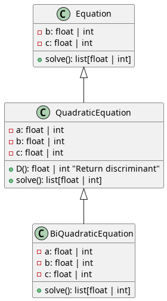

# ЛАБОРАТОРНА РОБОТА 3. Наслідування та поліморфізм

## UML Diagram 

## Task 1
Опишіть клас Equation (Рівняння), що моделює лінійне алгебраїчне 
рівняння виду: $$bx+c=0$$

Опишіть у ньому метод solve(), що повертає усі розв’язки цього рівняння, залежно від його коефіцієнтів. 
Створіть класи QuadraticEquation (Квадратне рівняння) та BiQuadraticEquation (Біквадратне рівняння), що є нащадками 
класу Equation та моделюють рівняння виду:
$$ax^2+bx+c=0$$
$$ax^4+bx^2+c=0$$

Опишіть для них метод solve(), який заміщує відповідний метод 
батьківського класу та коректно розв’язує кожне з цих рівнянь, повертаючи 
кортеж його розв’язків

## Task 2
Використовуючи вищенаведену ієрархію класів розв’яжіть таку задачу: 
Задано список рівнянь, кожне з яких визначається списком коефіцієнтів 
починаючи з коефіцієнта при найвищому степені.

Усі рівняння зберігається у текстовому файлі – список коефіцієнтів кожного 
рівняння розміщується в окремому рядку. Коефіцієнти розділені одним або 
кількома символами пропуску. 
Серед заданих рівнянь знайдіть ті з них, що:
- не мають розв’язків;
- мають один розв’язок;
- мають два розв’язки;
- мають три розв’язки;
- мають чотири розв’язки;
- мають нескінченну кількість розв’язків.

Крім цього вкажіть рівняння, що має:
- найменший розв’язок,
- найбільший розв’язок,
серед розв’язків усіх рівнянь, що мають рівно один розв’язок.
